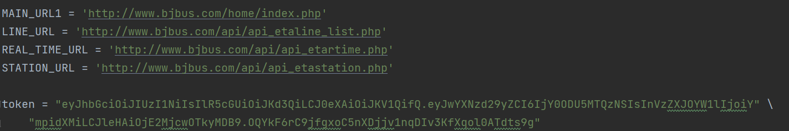
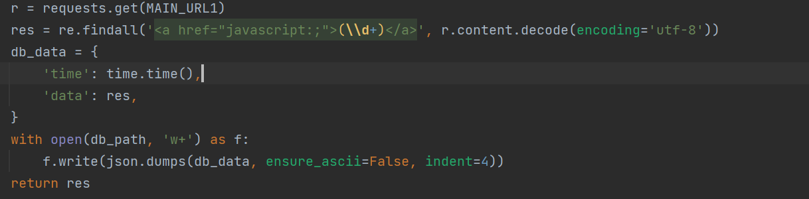
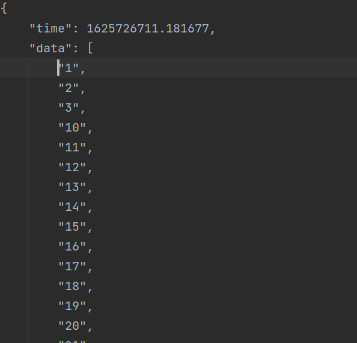
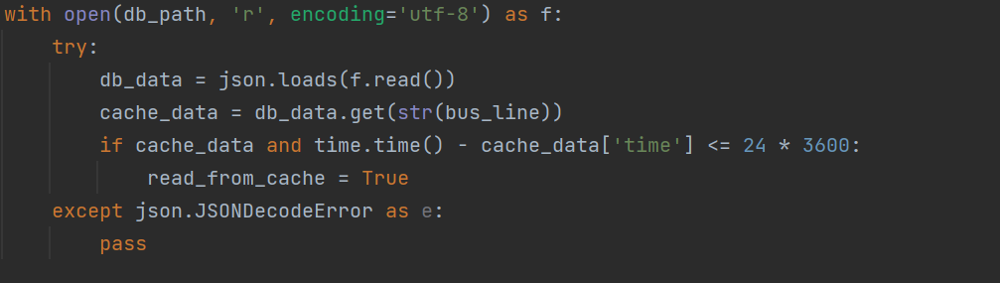
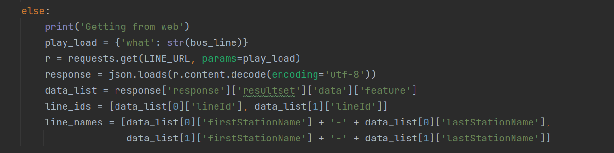
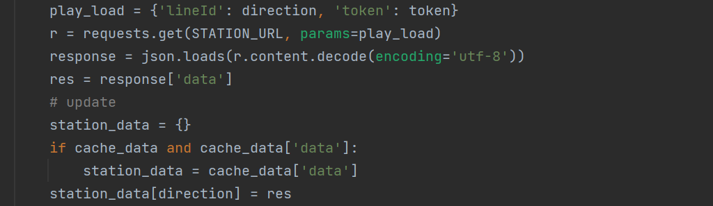
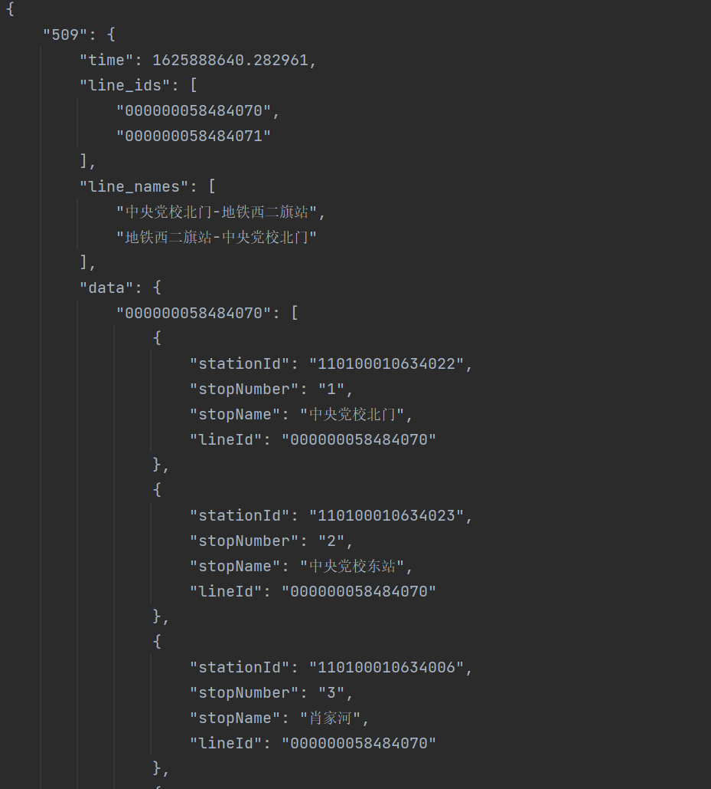
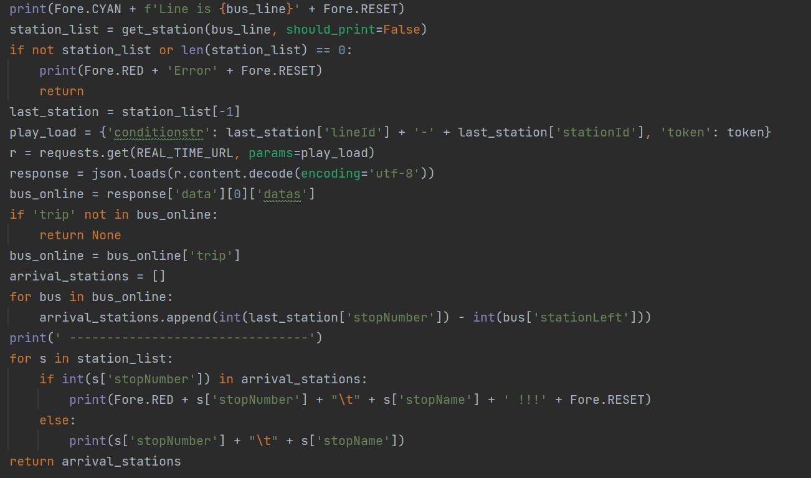
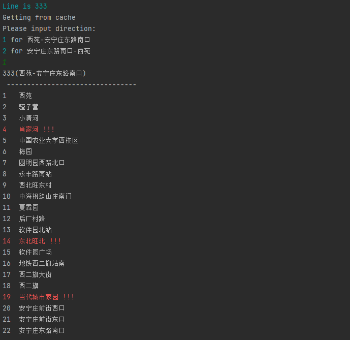

+++
author = "J-Ariza"
title = "python实现北京公交实时查询"
date = "2021-07-11"
description = "一个查询北京公交线路到站情况的python package"
categories = [
    "Python",
    "Python实践"
]
tags = [
    "Python",
    "Python实践"
]
image = "bus.jpg"
+++

# 起源
我最近在学习python，学的过程中打算完成个小的项目。于是在网络搜索关键词“python入门项目”，在所有的结果中出现了【查询实时公交路线】这个api，个人
感觉既简单又有些意思。 ~~（谁知这个api最后早就过期了。。这也是开发过程中一个稍显麻烦的地方。）~~

本文通过一下3个部分介绍实现过程，
1. 搜索（捡现成的）
2. 工程结构以及具体实现
3. 上传到pypi

## 搜索

作为python菜鸟，还是像观摩一下前辈们的用法以及产出效果。 开发过程中我主要参考的是
[Python实现命令行监控北京实时公交之一](https://segmentfault.com/a/1190000014324320)。
此文涉及到网络请求，结果缓存（这个我没想到，而且作者实现的方式也很简洁），结果输出（对命令行的排版），可以看到内容还是很丰富的。

前面说到之前网上搜索的api不能用了，于是就开始了各种尝试，先去了各大免费api平台看有无现成的，结果自然是没有。要么就是一个小网站还要注册，还不保险。
最后是在github上面检索到的，输入关键字 ‘beijing bus’， 并且按照 **时间倒叙查找**， 终于找到了某位大佬的小作业，里面还有请求实时公交的过程，
我试了一下，疗效不错。 链接在此，
[Zoutianjian/Beijing_Bus_realtime_query](https://github.com/Zoutianjian/Beijing_Bus_realtime_query)

## 工程结构以及具体实现

### 项目结构

为了开发的规范性，写代码之前要设计好项目结构。对python项目来说，这个也是有规范可以依据的。
[python 软件目录结构规范](https://cloud.tencent.com/developer/article/1175298).
简单来说，最外层目录是项目根目录用项目命名，在它下面建立一个同名文件夹，真正的开发代码放在这里面。 

同级建立tests目录，存放单元测试代码。

同级建立 requirements.txt 里面写入所有你用到的第三方包，这样当别人clone你的项目运行时，只需要 `pip install -r requirements.txt` 就可以
安装所有需要的包了。

如果打算上传到pypi，则需要setup.py

如果用到流水线，则在项目根目录根据各种CI的要求放置配置文件，我这里用的是 .travis.yml. (这个后面也许会单独写个文章简述流水线配置，真的太烦了，
我项目一半以上的提交用来配置流水线了。。) 

    Foo(根目录，git目录)/ 
    |
    |-- foo(项目源码)/
    |   |
    |   |-- __init__.py
    |   |-- main.py
    |-- tests(单元测试代码)/
    |   |
    |   |-- __init__.py
    |   |-- test**.py
    |
    |-- docs/
    |   |-- conf.py
    |   |-- abc.rst
    |
    |-- setup.py
    |-- requirements.txt
    |-- README.md
最后类似长这个样子。

### 项目核心代码

首先明确需求，当用户输入某条线路代码时，列出双向所有的站点。 如果用户进一步确认了方向，则显示这路车在这个方向上的所有车的到站情况。
这样需要做的事情就明确了，
- 需要请求网络部分，用来查找公交的具体情况。
- 需要缓存部分，如果用户输入间隔时间较短，就不必在请求网络。
- 需要一个对用户友好的输入输出界面，命令行也能做到。

1. 网络请求

  

MAIN_URL1 用来获取北京市所有的公交线路。 返回的结果并不是json类型的，所以使用正则表达式`<a href="javascript:;">(\\d+)</a>`来提取。
 

最后保存的结果如下图所示
 

-------

LINE_URL 用来获取某条路线的所有站点。 但是在请求网络之前，我们先判断用户对同一线路的请求间隔是否在24h以内，如果是，那么就从缓存中取出站点信息。

这个接口返回的数据是json类型，直接使用python自带的json包进行解析即可，这里注意，要保存住`lineid`, `linename`等关键信息，因为后面的实时查询接口要用到。

---
接下来就是让用户输入方向，最后输出这个方向上的所有站点并保存。 这里用到了 STATION_URL，这个接口是需要传入请求参数的。

最终保存的结果如下，

其中，time字段是保存时间用来判断是否读缓存； line_ids是这条路线双向的路线编码； data里面保存的就是某条方向中的站点列表，每个站点实体都需要记录
`stationId`, `stopNumber` 信息，同样是为了后续的实时查询使用

---

最后，REAL_TIME_URL 负责查看某条公交线路的实时情况。

这个接口的请求参数需要token，打开 http://www.bjbus.com/home/fun_rtbus.php?uSec=00000160&uSub=00000162  
可以通过F12或者抓包等各种方法得到。 为了输出所有正在运行中的公交，我们将待查询的站点硬编码为这个方向上的最后一站，这样在这个
接口的返回结果里面，就会包括前面各站的到站信息，也就是是否有车在周围。

### 命令行输出结果

命令行的结果也是可以有颜色的！ 我们引入 colorama 这个包，来上色。 其中红色的站点表示此站有车，如果你不在的话就会错过。

另外，python也可以输出程序中定义好的__doc__. 可以看一下项目源码。

## 打包上传到pypi

这一步的产出结果可以让所有python开发者都可以使用你的代码，只需要进行标准的pip install.

上传也是通过python命令行进行的，因此需要做一些准备工作。具体可以搜索一下。
我在这一步遇到了一些问题，就是项目中的txt文件传不上去。 折腾了半天，在StackOverflow上面找到了答案。 在 MANIFEST.in 文件里面写入你需要的txt，
并且在 setup.py 中， include_package_data=True。

希望大家这一步会很顺利。

## 使用

1. 在命令行中 `pip install moniter-bus-peking`
2. 在项目里面， `from moniter_bus import bus`
3. 查找公交站点 `bus.get_station(509)` 509可以换成其他路线。
   
   查找实时公交  `bus.get_real_time_bus(509)`
   
直接在命令行中按照提示输入方向，就可以看到结果。

# 结尾

欢迎 pip install.

欢迎到repo里面提issue， [项目源码](https://github.com/dev-J-Ariza/moniter_bus)

感谢开源世界， 
    [Python实现命令行监控北京实时公交之一](https://segmentfault.com/a/1190000014324320)

[Zoutianjian/Beijing_Bus_realtime_query](https://github.com/Zoutianjian/Beijing_Bus_realtime_query)

<svg class="canon" xmlns="http://www.w3.org/2000/svg" overflow="visible" viewBox="0 0 496 373" height="373" width="496"><g fill="none"><path stroke="#000" stroke-width=".75" d="M.599 372.348L495.263 1.206M.312.633l494.95 370.853M.312 372.633L247.643.92M248.502.92l246.76 370.566M330.828 123.869V1.134M330.396 1.134L165.104 124.515"></path><path stroke="#ED1C24" stroke-width=".75" d="M275.73 41.616h166.224v249.05H275.73zM54.478 41.616h166.225v249.052H54.478z"></path><path stroke="#000" stroke-width=".75" d="M.479.375h495v372h-495zM247.979.875v372"></path><ellipse cx="498.729" cy="177.625" rx=".75" ry="1.25"></ellipse><ellipse cx="247.229" cy="377.375" rx=".75" ry="1.25"></ellipse></g></svg>




